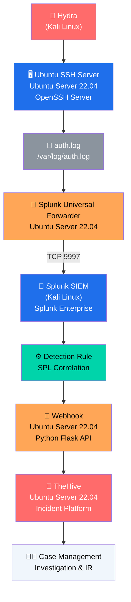

<div align="center">

# 🛡️ SSH BRUTE-FORCE DETECTION ALERT PIPELINE

### End-to-End SOC Pipeline — Attack Simulation → SIEM Detection → SOAR Automation → Case Management

[](https://www.splunk.com/)
[](https://thehive-project.org/)
[](https://flask.palletsprojects.com/)
[](https://www.docker.com/)
[](https://www.kali.org/)
[](https://ubuntu.com/)

</div>

---

## 📖 Overview

This project is a **fully automated Blue Team / SOC lab** that simulates a realistic SSH brute-force attack and demonstrates a complete enterprise-style detection-to-response pipeline — built and run entirely on open-source tooling across two VirtualBox VMs.

A brute-force attack launched with **Hydra** generates failed-login events in `/var/log/auth.log` on an Ubuntu SSH server. These logs are forwarded in real time to **Splunk Enterprise**, where a custom **SPL detection rule** identifies the attack pattern, fires a **scheduled alert**, and triggers an **HTTP webhook**. A lightweight **Python Flask** service receives the webhook and automatically opens a fully-populated **case in TheHive** — ready for a SOC analyst to triage.

**End result:** from the moment Hydra starts brute-forcing SSH to the moment an analyst sees a tagged, severity-rated case in TheHive — **under 2 minutes, zero manual steps.**

---

## 🧩 Pipeline Architecture



<details>
<summary>📋 ASCII diagram (fallback for non-Mermaid viewers)</summary>

```
+----------------------+
|        Hydra         |
|     (Kali Linux)     |
+----------+-----------+
           |
           v
+----------------------+
| Ubuntu SSH Server    |
| Ubuntu Server 22.04  |
| OpenSSH Server       |
+----------+-----------+
           |
           v
+----------------------+
|      auth.log        |
| /var/log/auth.log    |
+----------+-----------+
           |
           v
+----------------------+
| Splunk Universal     |
| Forwarder            |
| Ubuntu Server 22.04  |
+----------+-----------+
           |
           | TCP 9997
           v
+----------------------+
|     Splunk SIEM      |
|     (Kali Linux)     |
|  Splunk Enterprise   |
+----------+-----------+
           |
           v
+----------------------+
|   Detection Rule     |
|   SPL Correlation    |
+----------+-----------+
           |
           v
+----------------------+
|       Webhook        |
| Ubuntu Server 22.04  |
| Python Flask API     |
+----------+-----------+
           |
           v
+----------------------+
|       TheHive        |
| Ubuntu Server 22.04  |
| Incident Platform    |
+----------+-----------+
           |
           v
+----------------------+
|   Case Management    |
| Investigation & IR   |
+----------------------+
```

</details>

---

## 🧪 Technology Stack

| Component | Technology | Notes |
|---|---|---|
| Attacker OS | **Kali Linux** | HP EliteBook, i7 11th Gen, 16GB RAM |
| Target OS | **Ubuntu Server 22.04** | VirtualBox VM (`10.88.11.192`), OpenSSH Server |
| Attack Tool | **Hydra v9.6** | `rockyou.txt` wordlist (14,344,399 passwords) |
| Log Source | **`/var/log/auth.log`** | sshd authentication events |
| Log Collector | **Splunk Universal Forwarder** | Ships logs to port `9997` |
| SIEM | **Splunk Enterprise 10.2.3** | Kali Linux — `localhost:8000` |
| Detection Language | **SPL** (Search Processing Language) | `rex`, `stats`, `where` |
| SOAR / Automation | **Python Flask** | Webhook receiver — port `5000` |
| Case Management | **TheHive 5.7.1** | REST API — port `9000` |
| Database | **Apache Cassandra** | Docker container |
| Search Engine | **Elasticsearch** | Docker container |
| Reverse Proxy | **Nginx** | Docker container |
| Orchestration | **Docker Compose** | `prod1-thehive` stack |

---

## ⚡ Key Results

| Metric | Value |
|---|---|
| 🔑 Passwords tested | **14.3M+** (rockyou.txt) |
| 📂 Cases auto-created in TheHive | **34+** |
| ⏱️ Attack → Case latency | **< 2 minutes** |
| 🎯 Detection threshold | **5+ failed attempts / 5-min window** |
| 🔄 Alert schedule | **Every 1 minute** (`* * * * *`) |
| 🔢 Pipeline stages | **10**, fully automated |

---

## 🔍 Detection Logic (SPL)

```spl
source="/var/log/auth.log" "Failed password"
| rex field=_raw "Failed password for (?:invalid user )?(?<username>\S+)"
| rex field=_raw "from (?<src_ip>\d+\.\d+\.\d+\.\d+)"
| stats count as failed_attempts by src_ip username
| where failed_attempts >= 5
```

**Alert configuration:**

| Setting | Value |
|---|---|
| Alert Type | Scheduled |
| Cron Expression | `* * * * *` (every minute) |
| Time Range | Last 15 minutes |
| Trigger Condition | Number of Results > 0 |
| Trigger Mode | For each result |
| Action | Webhook → `http://10.88.11.192:5000/webhook` |

---

## 🐍 SOAR Automation — `webhook.py`

A minimal Flask service receives the Splunk webhook payload and creates a case in TheHive via its REST API.

```python
from flask import Flask, request, jsonify
import requests

app = Flask(__name__)

THEHIVE_URL = "http://localhost:9000"
THEHIVE_API_KEY = "YOUR_THEHIVE_API_KEY"   # ⚠️ store in an env var / secrets manager


@app.route('/webhook', methods=['POST'])
def webhook():
    data = request.json
    print("\n==============================")
    print("SSH BRUTE FORCE ALERT RECEIVED")
    print("==============================")
    print(data)

    # Extract fields from the Splunk alert
    result = data.get('result', {})
    src_ip = result.get('src_ip', 'Unknown')
    count = result.get('count', '?')

    # Create a case in TheHive
    case_payload = {
        "title": f"SSH Brute Force Detected from {src_ip}",
        "description": f"Attacker IP: {src_ip}\nFailed attempts: {count}\nSource: Splunk Alert",
        "severity": 2,
        "flag": False,
        "tags": ["ssh", "brute-force", "automated"]
    }

    response = requests.post(
        f"{THEHIVE_URL}/api/v1/case",
        headers={
            "Authorization": f"Bearer {THEHIVE_API_KEY}",
            "Content-Type": "application/json"
        },
        json=case_payload
    )

    print(f"TheHive response: {response.status_code}")
    print(response.text)

    return jsonify({"status": "success"}), 200


if __name__ == '__main__':
    app.run(host='0.0.0.0', port=5000)
```

> 🔐 **Security note:** never commit a real API key. Use an environment variable, e.g.
> `THEHIVE_API_KEY = os.environ["THEHIVE_API_KEY"]`

**Sample webhook payload from Splunk:**

```json
{
  "sid": "scheduler__admin__search__RMD572...",
  "search_name": "SSH Brute Force Detection",
  "result": {
    "src_ip": "10.88.11.35",
    "username": "varis21",
    "failed_attempts": "156"
  }
}
```

---

## 🗂️ Auto-Created TheHive Case

| Field | Value |
|---|---|
| Title | `SSH Brute Force Detected from <src_ip>` |
| Severity | Medium (2) |
| TLP / PAP | AMBER / AMBER |
| Tags | `automated`, `brute-force`, `ssh` |
| Status | New |
| Assignee | `soc-api` (service account) |
| Description | Attacker IP, failed-attempt count, source (Splunk Alert) |

---

## 📸 Screenshots

> Add your screenshots to a `screenshots/` folder in this repo and update the paths below.

| Stage | Screenshot |
|---|---|
| Hydra attack + Splunk matching events | `screenshots/01-hydra-splunk.png` |
| SPL detection extracting src_ip / username | `screenshots/02-spl-detection.png` |
| Splunk alert configuration & webhook | `screenshots/03-alert-webhook.png` |
| Alert trigger history (continuous detection) | `screenshots/04-trigger-history.png` |
| Flask webhook receiving alerts | `screenshots/05-flask-webhook.png` |
| TheHive Docker stack running | `screenshots/06-thehive-docker.png` |
| TheHive auto-created case detail | `screenshots/07-thehive-case.png` |
| TheHive cases dashboard (34+ cases) | `screenshots/08-thehive-dashboard.png` |

---

## 🧭 Incident Response Workflow

1. **Alert Review** — open the case in TheHive, check severity & tags
2. **Attacker Identification** — note source IP, check threat-intel (AbuseIPDB / Shodan)
3. **Attack Frequency Analysis** — correlate `failed_attempts` with the Splunk timeline
4. **Impact Assessment** — check for any successful login after the brute-force
5. **Containment** — block the attacker IP, e.g. `ufw deny from <ip> to any port 22`
6. **Credential Reset** — rotate credentials for any targeted account
7. **Case Closure** — document findings, add observables, mark Resolved

---

## 🗺️ Enterprise SOC Mapping

| Enterprise SOC Stage | Enterprise Tool Example | This Project |
|---|---|---|
| Threat Simulation | Red Team / Pentest | Hydra v9.6 |
| Log Collection | Splunk HEC / Beats | Splunk Universal Forwarder |
| SIEM | Splunk Enterprise / Sentinel | Splunk Enterprise 10.2.3 |
| Detection Rules | Sigma / YARA / Custom SPL | Custom SPL + regex |
| Alerting | PagerDuty / SIEM Alert | Splunk Scheduled Alert |
| SOAR Automation | Splunk SOAR / Cortex XSOAR | Python Flask Webhook |
| Case Management | ServiceNow / Jira / TheHive | TheHive 5.7.1 |
| Analyst Response | SOC Tier 1/2 Investigation | Structured IR Workflow |

---

## 🚀 Setup Summary

1. **Target VM (Ubuntu):** install OpenSSH server, Splunk Universal Forwarder, Docker + Docker Compose, and the TheHive stack (Elasticsearch, Cassandra, TheHive, Nginx).
2. **Attacker VM (Kali):** install Splunk Enterprise and Hydra.
3. Configure the Universal Forwarder's `inputs.conf` to monitor `/var/log/auth.log` and `outputs.conf` to forward to the Splunk indexer.
4. Create the SPL detection search above as a **scheduled alert** with a webhook action pointing to `http://<ubuntu-ip>:5000/webhook`.
5. Run `webhook.py` on the Ubuntu VM (`python3 webhook.py`).
6. Bring up TheHive: `docker compose up -d`.
7. Launch the attack: `hydra -t 1 -l <user> -P /usr/share/wordlists/rockyou.txt ssh://<target-ip>`.
8. Watch cases appear automatically in TheHive 🎉

---

## 🧠 Skills Demonstrated

**Blue Team / SOC** — Log Analysis · Incident Detection · SOC Monitoring · SIEM Engineering
**Detection Engineering** — SPL Queries · Regex Extraction · Alert Tuning · Threshold Detection
**SOAR / Automation** — Webhook Integration · Python Automation · JSON Processing · Case Management
**Infrastructure** — Linux Administration · Docker · VirtualBox Networking

---

## 👤 About the Author

**Varis Rahman**
Cybersecurity Student | Aspiring SOC Analyst & Penetration Tester
Advanced Diploma in Cyber Security — Offenso Hackers Academy | BBA — Calicut University, Kerala, India

[](https://github.com/VARISRAHMAN)
[](https://linkedin.com/in/varis-rahman-)
[](https://x.com/Varis1310783)

---

## ⚠️ Disclaimer

This project was built in an **isolated home-lab environment** for educational and portfolio purposes. The credentials, IP addresses, and API keys shown are lab-only values from a private VirtualBox network and carry no access to any production system. Do not use brute-force tools against systems you do not own or have explicit authorization to test.

---

<div align="center">
⭐ If you found this project useful, consider giving it a star!
</div>
